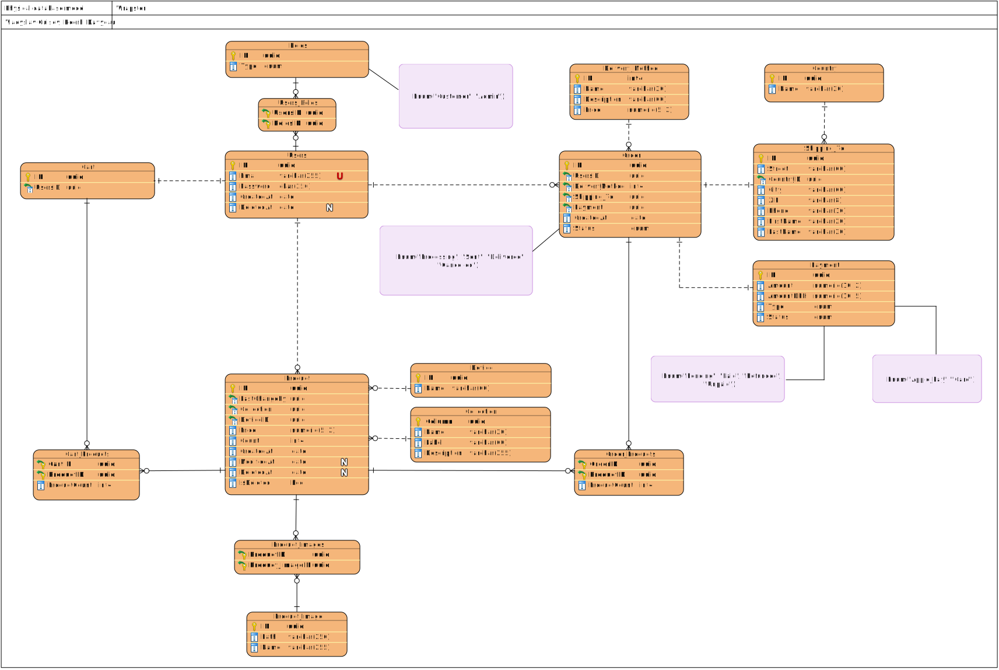

# Wrapster
> Made by Vladyslav Gusiev and Heorhi Davydau

---

> [!CAUTION]
> This educational project utilizes data obtained from the official website of [dbrand](https://dbrand.com) and is strictly for educational purposes. Permission for usage has been granted by dbrand, with the understanding that it will not be utilized for commercial gain. For any usage beyond educational purposes, please contact dbrand directly.

### Message from dbrand:

Hey Heorhi!

Thanks for your patience; we're experiencing significantly higher ticket volume. Provided it's solely for educational purposes and you are in no way earning money from said project, it shouldn't be an issue if you wish to use assets from our website for it. We appreciate you taking the time to reach out and ask. Let us know if there's anything else we can help with and have a great day!
Signed,
A Robot

---
## Link to Github Page

[Link to Github page](https://techoctopus.github.io/wrapster/)

---
## Figma prototype

[Link to Figma](https://www.figma.com/file/nnLBWQ5X0GyKEodRM3GMst/low-fidelity?type=design&mode=design&t=2eulmmBXDwqD9jo3-1)

---
## Physical Database Model

All datatypes are from PostgreSQL.
